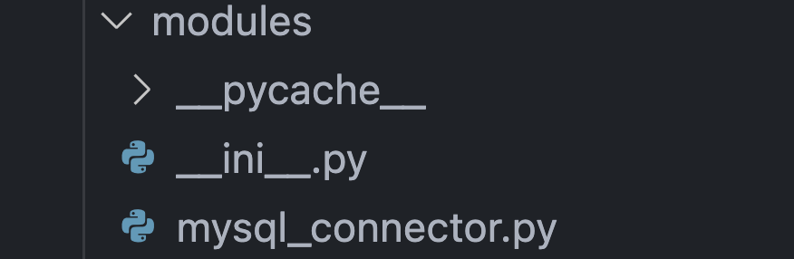

# Implement Python Class for MySQL Database Connection and Project Setup

###### The goal is to create a Python project that connects to a MySQL database using a class with specific methods. The project will follow a structured format, including a folder for modules, a folder for credentials (which should be ignored by Git), and a main file for execution. The project will also include a requirements.txt file, a READMEmd file for documentation, and will be pushed to a GitHub repository.

---

**Initial Task**
* Create a new virtual environment for these tasks
    -   I created a folder wich inside I executed the next command lines:
        >#What version we have:
        >`~ python3 --version` 
        >#Create the environment with a name:
        >`~ python3.12 -m venv 'name'`
        >#Activate the environment:
        >`~ source 'name'/bin/activate`
    
        

| **TASK**    | :white_check_mark: |
| :---        |               ---: |

---

1. Create the Project Structure

    * Create the project root folder and the following structure:

        ```
        database_connections_project/
        ├── cred/
        ├── modules/
        ├── src/
        ├── requirements.txt
        ├── main.py
        ├── README.md
        └── .gitignore
        ```
**Task:**
* Create the cred, modules, src folders, requirements.txt, main.py, README.md, and .gitignore files.
    - Create project folders and files:

        

* Ensure the cred/ folder is added to .gitignore to avoid committing sensitive credentials to Git.
    - write in .gitignore the folder name to avoid committing.

        

| **TASK**    | :white_check_mark: |
| :---        |               ---: |

---

2. Store Credentials in YAML Format

    * In the cred/ folder, create a file named db_credentials.yaml to store the database connection details in the following format:

        >`mysql:`
        >`  host: "localhost"`
        >`  user: "root"`
        >`  password: "your_password"`
        >`  database: "sakila"`

**Task:**
* Create the YAML file and save the MySQL connection credentials.
    - Write in the yaml file into cred folder, the name of the system to use credentials and under it the credentials.

        

    - To invoice the credentials we call the yaml file from the py file.

        

| **TASK**    | :white_check_mark: |
| :---        |               ---: |

---

3. Implement MySQLConnector Class

    * Inside the modules folder, create a file named mysql_connector.py.
    
    * Modify the MySQLConnector class to read the credentials from the YAML file in cred/:
    
    * __ init __ (self, cred_file): Initializes the class, reads the credentials from the YAML file.  
    
    * Get_connection(self): Establishes connection with the database and returns a cursor.  
    
    * Close_connection(self): Closes the active connection.  
    
    * query(self, sql_query): Executes an SQL query and returns a Pandas DataFrame with the results.  
    

**Task:**
+ Implement the MySQLConnector class inside mysql_connector.py and modify the constructor to read from the YAML file.

    - We read the credentials yaml with:

        > `~with open('yaml route') as file:`

    - With yaml function safe_load, we are loading the variables in the file into a variable

        > `~    yamll = yaml.safe_load(file)`

    - We can use all the variables in the yaml just by indicate the name of the system an then the variable

        > `~yamll['mysql']['user']`

    - The path is given in the instance of the class as parameter 
    

| **TASK**    | :white_check_mark: |
| :---        |               ---: |

---

4. Create requirements.txt

    * Create a requirements.txt file in the project root
    

**Task:** 
* Add necessary libraries to requirements.txt. 
    - We need to add the name of the libraries thet we gonna use un the project, and the for a quick intallation of packages que use the command:

        > `~pip install -r path/requirements.txt`

        

| **TASK**    | :white_check_mark: |
| :---        |               ---: |

---

5. Write the Main Script (main. py)

    * In the main. py file, create a script to:

    * Initialize the MySQLConnector class, passing the path to the db_credentials.yaml file.

        

    * Establish a connection to  sakila database .  

        

    * Run a sample query on a sample database (e.g., SELECT * FROM actor LIMIT 5;). 

        

    * Print the results as a Pandas DataFrame. 

        

    * Close the connection.

          

**Task:** 
* Write the code in main. py to test the connection and run queries. 

    - The variable "conexion" create an instance o "Conexion" with the path as parameter and it have the methods "get_conection, query and close_connection"
         

    - The output of the main file at the prompt are the fallowing:
        

| **TASK**    | :white_check_mark: |
| :---        |               ---: |

--- 

6. Set Up .gitignore

    * Create a .gitignore file in the project root and ensure it contains the following lines to exclude the cred/ folder from Git commits:  

        - cred/ 
        

**Task:** 
* Ensure the .gitignore file is properly set up to exclude sensitive credential files.
     
    - We write all folder or file that we dont want to add to the github repository.
            
        

| **TASK**    | :white_check_mark: |
| :---        |               ---: |

--- 

7. Create a README.md File

    * Create a README.md file in the root of the project with a brief description of the project. Include:  

        + Project purpose.
        

        + Instructions for setting up the environment.
        

        + Usage examples, including how to load credentials and run the application.
        

**Task:**
* Create the README.md file with the necessary details.

    - We creare the READMEmd that que make the cover of our git/hub project. For this file we use a "markdown" lenguaje wich is idoneous for descriptions of git/hub repositories.
        

| **TASK**    | :white_check_mark: |
| :---        |               ---: |

--- 

8. Push the Project to GitHub

    * Initialize a Git repository in the project folder:

        * git init
        
        * git add .
        
        * git commit -m "Initial project setup for MySQLConnector class with credentials management"
        

    * Create a GitHub repository and push the local repository to GitHub:

        * git remote add origin <your_github_repository_url>
        
        * git push -u origin master
        

**Task:** 
* Push the entire project to GitHub and ensure the repository is public for review.

    - The repository are now on-line with all the steps and documentation to the peer review stage:
        

| **TASK**    | :white_check_mark: |
| :---        |               ---: |
---

# CouchDB
***We agregated a class with conection, selection of DB and two querys, one qith mango and another using views created at fauxton for the CouchDB porject and a conditions in the main for a OS selection and a Mysql o CouchDB iteraction.***
* Main
    
* Class
    